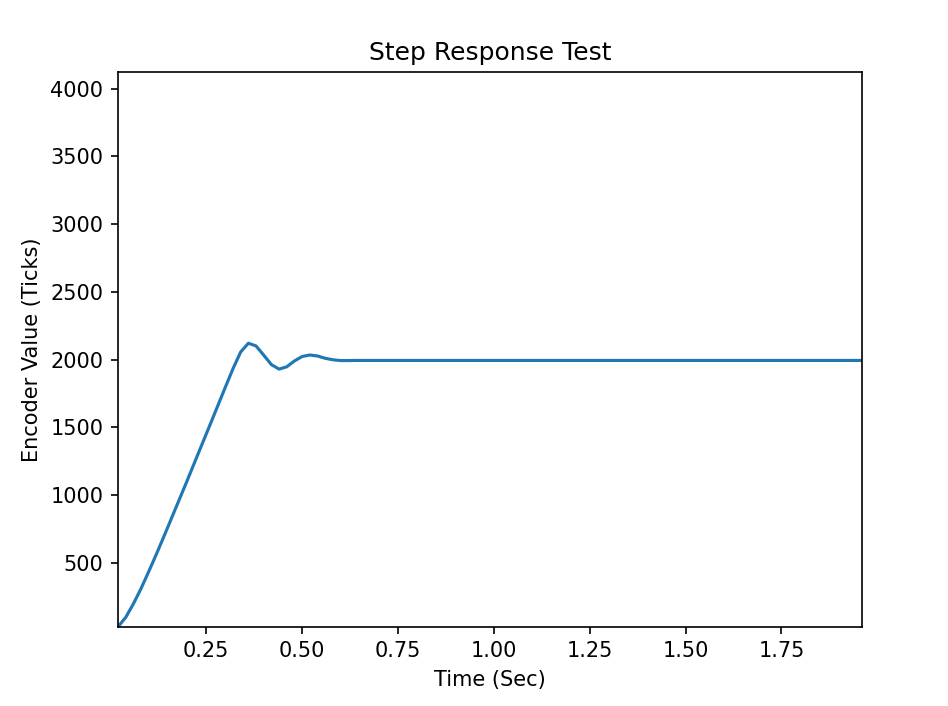

# me405_lab3
## Description:
This repository is for Lab 3 in the ME-405 class to test multitasking using two motors, a closed loop controller and a step response test.
Please install all the files in src onto the MicroPython Board except for pc_com.py.
Run main.py on the MicroPython Board and then pc_com.py on the PC to connect the communication and data.
*May need to adjust the COMS port number in the pc_com.py file*

## MultiTask
The goal of this experiment is to establish a multitasking system to run two motors to different positions while collecting data to produce a step response test graph.
Three tasks were created, two of them being to run each motor and their controllers and the last task being to collect the data into serial prints.
Below are brief descriptions of the task.

### Motor 1 Task and Motor 2 Task
These two tasks are similar in collecting and sending encoder data into a queue to be printed in task three, while also sending data into the controller to minimize overshoot.

### Data Collect Task
This task pulls data from the queue and prints them into the serial port to have graphed on the PC side of the communication

To ensure the efficiency of the multitasking control system the motor tasks were run at different frequencies.
Below are the step response tests results using a motor gain of 0.1 with a target position of 2000 ticks ran over the course of 2 seconds:

The first trial was conducted at a very slow speed (high interval) of 100 milliseconds resulting in an unstable behavior.
Figure 1 shows that the controller is unable to adjust the PWM output fast enough to correct the motor position to the desired location.

Figure 1. Speed Interval = 100ms

Figure 2 shows  similar results to Figure where the motor behavior is little less unstable, but the controller still is unable to adjust the PWM output fast enough to correct the motor position to the desire location.

Figure 2. Speed Interval = 50ms

Figure 3 shows promising results as the motor stables out, with minor oscillations.

Figure 3. Speed Interval = 20ms

It is recommended to use 10ms as the speed interval as it is the most stable motor result as seem in Figure 4.

Figure 4. Speed Interval = 10ms
